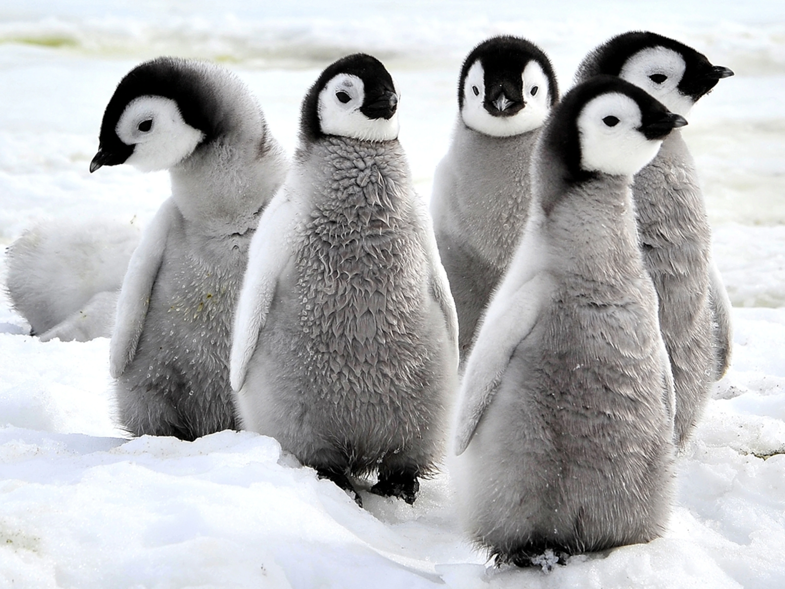

```{r setup, include=FALSE}
knitr::opts_chunk$set(echo = TRUE, fig.path= "../Output/",waring=FALSE, message=FALSE) #automatic save to output, takes away warning and messages
```

# __Load Libraries__
*These libraries will help with the code, data and colors*


```{r, message=FALSE, warning=FALSE}
library(tidyverse)
library(here)
library(palmerpenguins) #penguin dataset
library(kableExtra) #to create tables
library(calecopal) #a color palette for my plot
```

# __Inspect the Data__
*This data will be analyzed and used to make tables and plots*

```{r, echo=FALSE}
glimpse(penguins) #views the penguin data
```

# __Table__
*Mean flipper length by sex on 3 islands*

```{r penguintab,echo=FALSE, warning=FALSE, echo=FALSE,}
penguins %>% 
  group_by(island, sex) %>%  #selects for groups island and sex
  drop_na() %>% #gets rid of all na's in sex data
  summarise(flippmean = mean(flipper_length_mm, na.rm =  TRUE))%>%
  kbl() %>% #using kable to make a table
  row_spec(3, bold = T, color = "cornsilk", background = "darkgrey") %>% #changes the bacground and font colors
  kable_styling(full_width = FALSE) #makes table not fill entire space

```

# __Plot__
*Flipper length by sex*
 
There are three islands: 

* Biscoe
* Dream 
* Torgersen

Info on the Data:

* Male penguins tend to have longer flipper length than females on each island

* Flipper length varies by island

```{r penguin2, warning=FALSE, echo=FALSE, fig.align="center"}
penguins %>% 
  drop_na() %>% 
  ggplot(aes(x = sex, #creates x axis that differentiates between male and female
             y = flipper_length_mm, #creates y axis for flipper length in mm
             fill = sex))+ #fills plot with colors depending on sex
  geom_bar(stat = "identity")+ #makes a bar graph, need identity so that the geom_bar doesn't change the data
  labs(x = "Sex", #labels x axis as Sex
       y = "Flipper length (mm)")+ #labels the y axis ad Flipper lenth
  theme_classic()+ #takes away grid in the background
  facet_wrap(~island)+ #splits up male and female penguins flipper length by each island
  scale_fill_manual(values = cal_palette("casj")) #changes the fill color of bar graph
```

# __Cute Penguin Chicks__

 


